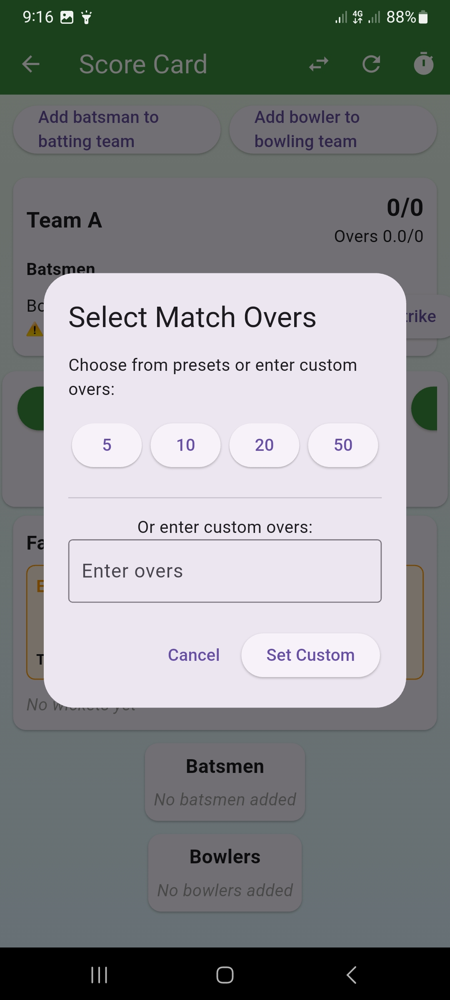
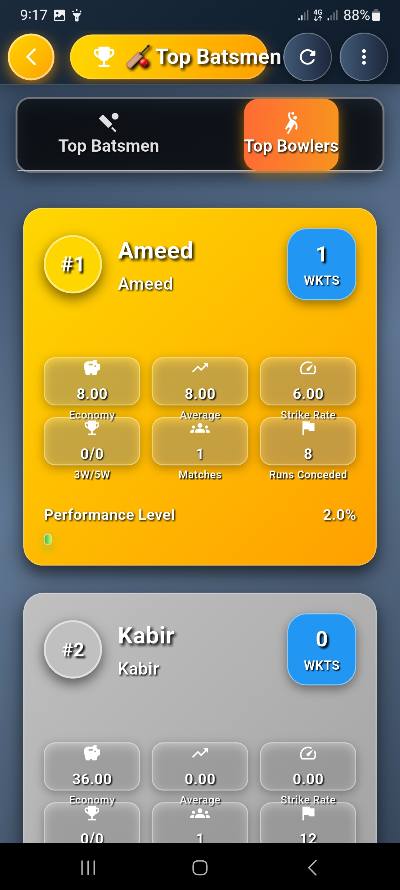
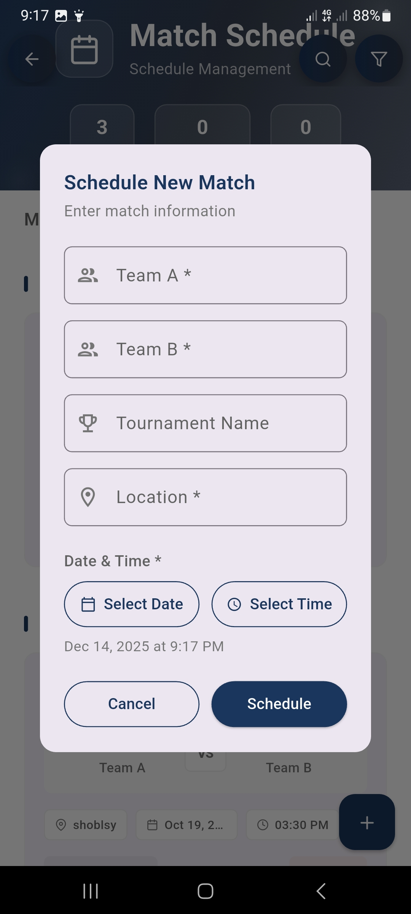
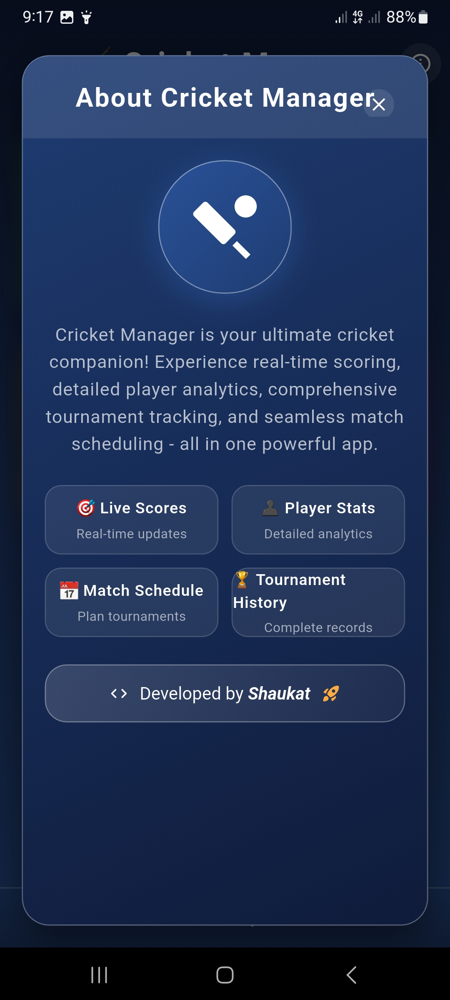

# 🏏 Gully Cricket Manager

**A Flutter app for street cricket lovers to manage matches, track scores, and analyze player stats like a pro.**

[](https://flutter.dev)
[](https://dart.dev)
[](LICENSE)
[](CONTRIBUTING.md)

## 📱 App Overview

**Gully Cricket Manager** transforms how you organize and score street cricket matches. Replace pen-and-paper scorebooks with a sleek digital interface that handles everything from live ball-by-ball scoring to automatic statistics and tournament leaderboards.

> 🎯 **Perfect for:** Neighborhood cricket, office tournaments, college matches, or any casual cricket game that deserves professional-grade tracking.

---

## ✨ Key Features

### 🏏 **Live Match Scoring**
- **Ball-by-ball tracking** with intuitive run buttons (0, 1, 2, 4, 6)
- **Smart player management** – select batsmen and bowler for each over
- **Automatic strike rotation** and partnership tracking
- **Real-time scorecard** with over-by-over commentary

### ⚡ **Extras & Wickets Handling**
- Dedicated buttons for **Wides, No Balls, Byes, Leg Byes**
- **Wicket tracking** with dismissal types (bowled, caught, run-out, etc.)
- Automatic ball count adjustment for extras

### 📊 **Performance Analytics**
- **Automatic leaderboards** showing **Top 5 Batsmen** (by runs, average, strike rate)
- **Top 5 Bowlers** (by wickets, economy, average)
- **Player profiles** with career statistics
- **Tournament-wise** performance tracking

### 📅 **Match Management**
- **Schedule future matches** with teams, venue, and overs
- **Match history** with filter options (by date, team, player)
- **Complete scorecard** access for past matches

### 👥 **Team & Player Database**
- Maintain a **roster of players** with roles (batsman, bowler)
- **Create custom teams** for different matches
- **Player statistics** that update automatically after each match

---

## 🎮 Quick Start

### Prerequisites
- Flutter SDK (version 3.0 or higher)
- Dart SDK (version 2.19 or higher)
- Android Studio / VS Code (with Flutter extension)
- Physical device or emulator

---

## 📸 Screenshots

<p align="center">
  
  
  
  
  
  
  
  
  
  
  
  
</p>


---

## 🛠️ Tech Stack & Architecture

### **Frontend**
- **Flutter** - UI framework for beautiful, natively compiled applications
- **Dart** - Client-optimized language for fast apps on any platform

### **State Management**
- **Provider** - Simple yet powerful state management for Flutter applications

### **Database**
- **Shared Preferences** - Lightweight storage for user settings

### **Architecture Pattern**
The app follows a **clean architecture** approach:
- **Presentation Layer** (Screens & Widgets) - Handles UI
- **Business Logic Layer** (Services & Providers) - Manages app state and rules
- **Data Layer** (Models & Database) - Handles data storage and retrieval

---

## 🔧 Development Guide

### Setting Up Development Environment

1. **Fork and clone the repository**
   ```bash
   git clone https://github.com/YOUR_USERNAME/gully_cricket.git
   ```

2. **Create a feature branch**
   ```bash
   git checkout -b feature/your-feature-name
   ```

3. **Make your changes and test**
   ```bash
   flutter test
   flutter analyze
   ```

4. **Commit and push**
   ```bash
   git commit -m "Add: Description of your feature"
   git push origin feature/your-feature-name
   ```

5. **Create a Pull Request**

### Code Style Guidelines
- Follow the [Dart style guide](https://dart.dev/guides/language/effective-dart/style)
- Use meaningful variable and function names
- Add comments for complex logic
- Write tests for new functionality

### Running Tests

```bash
# Run all tests
flutter test

# Run tests with coverage
flutter test --coverage

# Generate coverage report
genhtml coverage/lcov.info -o coverage/
```

---

## 📈 Statistics Calculation

The app automatically calculates these cricket statistics:

### **Batting Stats**
- **Batting Average** = Total Runs ÷ (Innings - Not Outs)
- **Strike Rate** = (Total Runs ÷ Balls Faced) × 100
- **Boundary Percentage** = (4s + 6s) ÷ Balls Faced × 100

### **Bowling Stats**
- **Bowling Average** = Runs Conceded ÷ Wickets Taken
- **Economy Rate** = Runs Conceded ÷ Overs Bowled
- **Strike Rate** = Balls Bowled ÷ Wickets Taken


---

## 🤝 Contributing

We love contributions! Here's how you can help:

1. **Report bugs** - Use the [issue tracker](https://github.com/shaukatdj07/gully_cricket/issues)
2. **Suggest features** - Open an issue with your idea
3. **Submit code** - Fork the repo and create a pull request

### **First Time Contributors**
Check out issues labeled `good-first-issue` to start with something simple.

### **Contribution Guidelines**
- Write clear commit messages
- Add tests for new features
- Update documentation as needed
- Follow the existing code style

---

## ❓ Frequently Asked Questions

### **Q: Does the app need internet connection?**
**A:** No! All data is stored locally on your device. No internet required for scoring matches.

### **Q: Can I export match data?**
**A:** Currently, data stays within the app. Export feature is planned for future release.

### **Q: Is it available on iOS?**
**A:** Yes! The app works on both Android and iOS devices.

### **Q: How many players can I add?**
**A:** There's no hard limit. Add as many players as you need for your tournaments.

---

## 🚀 Roadmap

### **Version 1.1 (Next Release)**
- [ ] Cloud sync between devices
- [ ] Export scorecards as PDF
- [ ] Player photo upload
- [ ] Enhanced match statistics

### **Version 2.0 (Future)**
- [ ] Multi-language support
- [ ] Live match streaming integration
- [ ] Fantasy cricket features
- [ ] Social sharing of scorecards

### **Long Term Vision**
- Become the go-to app for informal cricket worldwide
- Support multiple cricket formats (Tennis ball, Tape ball, etc.)
- Integrate with wearable devices for fitness tracking

---

## 📄 License

This project is licensed under the **MIT License** - see the [LICENSE](LICENSE) file for details.

## 👨‍💻 Author

**Shaukat DJ**
- GitHub: [@shaukatdj07](https://github.com/shaukatdj07)
- Email: shaukatdarshi777@gmail.com

## 🙏 Acknowledgments

- Thanks to the **Flutter community** for amazing resources
- All **contributors** who help improve the app
- **Street cricket players** everywhere for the inspiration
- **Testers and early adopters** for valuable feedback

## 🌟 Support

If you find this app useful, please:
- ⭐ **Star** the repository on GitHub
- 🐛 **Report** any issues you encounter
- 💬 **Share** with fellow cricket lovers
- 🔧 **Contribute** code or ideas

---

**"Because every street match deserves a proper scorebook!"** 🏏📊

*Happy Cricket Scoring!*

This project is open source and available under the MIT License.

⭐ Support

If you like this project, consider giving it a star on GitHub. Your support helps improve and expand the app further.

Happy Cricket Scoring 🏏
